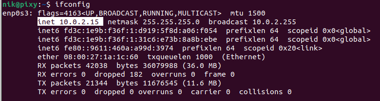

# Project 1

## Part 1 - Building VMs

- Guest VM used: Ubuntu Linux
- VMM (virtual machine manager / software): VirtualBox

### Setting up a Ubuntu VM on a Windows 10 host

- **NOTE** - think next semester, you'll take a class that needs familarity with virtual machines.  Give yourself the gift of good documentation

1. I installed my Ubuntu Linux ISO from their official webite (https://ubuntu.com/download/desktop) I chose this one because I was somewhat familiar with it though previously I mainly used Lubuntu.
2. VirtualBox was already installed with default setting I did this prior to starting this assignment because I had already had it installed from a previous class.

3. Create a new Virtual Machine - basically, determine the RAM and disk space the virtual machine will be allocated
    - How much disk space?  Fixed or flex?

10.0gb Fixed

    - How much RAM?  What about your host?

Ram for vm: 4.6 gb My host pc has 16gb

    - 3D acceleration?  What performance do you need out of your VM?  Do you even have GPU resources to make this really worthwhile?

3D Acceleration is enabled, I have a RTX 3060 so I have plenty of resources for this

    - Guest Additions - what are you loosing without it, what would you gain with it, and do you want it?

I have guest additions enabled because it just seems to add many quality of life features when interacting between the Host OS and the Guest OS the biggest use for me would be the ability to share a copy and paste clipboard.

4. Install an OS to the Virtual Machine
    - How to specify which ISO is the install ISO

With the case of the Ubuntu OS I installed it was the only iso in my downloads folder and it had the name of the OS I was installing.

    - Maybe (for your notes) any installation tips / tricks you did

I simply went with most of the default settings when setting up this VM it was simple enough and served the purpose I needed it to.

    - How to detach install ISO once done

 Mine automatically did this. If it doesn't you need to go to the storage settings on your VM and find where you put the ISO on the controller IDE and right click it and hit remove from virtual disk

## Part 2 - Exploring Virtualization

### Exploring Host Disk Usage
1. Describe where your Guest OS is saved and how much space it takes up

My guest OS is saved in the default VirtualBox VMs folder automatically created on my Host OS, it takes up 10.0gb currently

    - From your configuration above, is this going to expand?

Not unless I manually expand it's memory.

2. Can you directly access your Guest files from the virtual machine image folder?  Why or why not?

Not by default but if I go into the devices tab on VirtualBox and click on the shared folders option choosing which folders I'd like to manually share will allow me do to this.

3. Explore the sizes of creating "snapshots" vs. templates / clone.  What do each of these achieve?

Snapshots essentially are like a save point for your VM. The virtual disk image is about 4mb while the actual sav file is 743mb. The snapshot will increase in size with more changes you make to the disk.

### Exploring Guest Networking

- **NOTE** - assume standard out of box networking configuration, that is to say NAT networking
- Explain your approximate networking configuration for your Host - we talked about the home standard of:
    - modem from ISP, assigns public IP
    - router provides DHCP private network.  Devices are connected to your router, which is your gateway
    - your network requests to sites are routed through your router, which plugs in your public address, requests info from the world, gets the info back, then passes the request back to the device that made it (NAT - Network Address Translation)

The network configuration for my host is NAT

- Explain the network configuration for your Guest
    - Does your guest have a network accessible address?  For example, can other devices connected to your router get to it?
        - The usual answer is no, so how is your Guest getting network access?

Currently the network configuration is NAT which was the default setting. VirtualBox maps the VMs private IP address to my Host OS's TCP port number. Any traffic generated from this VM will appear as though it came from my Host OS's IP.

## Part 3 - Networking with Style

- Pick a networking method besides NAT, and see what it does.
- Document the networking configuration you choose.  
- In class, we explored bridged & host-only networking, and demonstrated the effects of each of these.
- If I were writing this up, I would likely use the example where I installed a web server and played with accessing it from the different IP configured on my host and guest

I the networking method I chose for this project is bridged:
To do this I went into my networking settings for my VM and changed the network configuration from NAT to bridged and selected the proper adapter, my computer is already wired into my router to I selected the adapter that is connected to (mine being Realtek PCIe GbE Family Controller) and selected the box that said the cable was connected. From some research I found out under a bridged connection the IP to my VM should be very similar to my IP for my Host computer and have a different IP compared to when it was under a NAT networking method. Upon changing to this bridged connection using the settings I have selected the VM had no issues connecting to the internet I even experimented with it by making a few searches using Firefox. The following screenshots will show the changes noticed.

ifconfig under NAT network type:

ifconfig when changed to bridged network type:

Using ipconfig on my host OS:

Proof of using internet on VM under bridged networking type:

