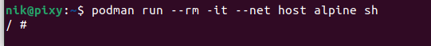
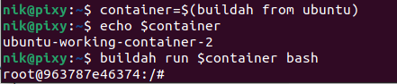

# Project 2

## Container 1

### Platform: Podman  

### Installation Instructions  

According to Podman's website all I needed to do to install podman on Ubuntu is to enter these following commands:  
sudo apt-get update -qq  
sudo apt-get -qq -y install podman  

### Pulling with podman

There a multiple ways to pull an image with podman the version I used for this project was pulling with short-name resolution.  
The image I chose to play with was alpine and the command I used to pull the image was:  
podman pull alpine  
alpine was popular enough that just telling podman to pull it was enough to pull alpine into my container without having to get anymore specific.

### Viewing container images in podman  

typing the command 'podman images' will list all of the current imgaes available on your container

### Different modes for podman

Initialize: Initialize also referring to as init will prefroms all tasks nessessary for starting the container but will actually start the container. The is meant to be used for inspecting and modifying the containers files system prior to starting it. It allows you to do things such as debuging a container that fails to run.  

Run: Does every task starting a container but unlike initialize it will actually start the container. If you have no need to inspect or debug a container this is the option you'd want to use. If the container fails to run then you'd want to use initialize.

### Running and entering a shell  

So there are probably better ways to do this but the command I was able to run to get into alpine using podman was 'podman run --rm -it --net host alpine sh'  

Here is what it looks like when I use that command:  

### Detached mode

Detached mode or -d allows you to run the container in the background and print the new container ID. It allows you container to still be running even after you exit podman.

### Logs and Status

Status: 'podman ps' allows you to check the status of all your containers  

Logs: 'podman logs (container name or id)' allows you to view a containers logs with podman  

## Stopping a Container

pause: 'podman pause (name of container or id)' allows you to pause a container  

restart: 'podman restart (container name or id)' allows you to restart a container  

resume: 'podman unpause (container name or id)' allows you to resume a container's process  

stop: 'podman stop (container name or id)' allows you to stop a container

kill: 'podman kill (container name or id)' allows to kill the main process of a container

## Container 2

### Platform: buildah

### Installation Instructions

Much like podman the installation process is pretty simple all you need to do is type the following commands:  
'sudo apt-get -y update'  
'sudo apt-get -y install buildah'

### Pulling with buildah

For pulling an image there are many ways to do it but once again for this lab I went by searching with a short-name. For buildah I pulled Ubuntu instead of Alpine. The command I used to pull this image was:  
'buildah pull ubuntu'

### Viewing container images in buildah  

The command 'buildah images' allows you to see all the container images installed on my system, interestingly it shows the images I previously pulled using podman.

### Different modes for buildah

For buildah there does not appear to be a way to initialize a container the only thing I was able to find about it was a github issue thread for buildah that complains about there not being an init option link here: https://github.com/containers/buildah/issues/1961  

In order to run a container in buildah there are a few steps that you need to first which I will explain when I explain how to enter a shell but once you have the basic setup for a container done all you need to do it type the following command:  

'buildah run $container bash'

Because I could not find a way to initialize a container I can't really compare either method since run seems to be your only option.  

### Running and entering a shell  

To run an enter a shell in buildah what you have to do is enter the following commands:  

'container=$(buildah from ubuntu)'- I imagine this just sets the current container you'd like to run  

'echo $container'- This just tells you the container that is selected more or less just to double check that you picked the right one 

'buildah run $container bash'- this command runs the container and enters the shell

Here is what the following commands will do:  

### Detached mode

Like initializing there does not appear to be an option to run a container in detached mode, or at least I could not find one in the documentation for the container

### Logs and Status

Again, I was unable to find a way to check the logs of buildah or a way to check the status of containers. These features do not appear to exist when I checked through the documentation for it.

### Stopping a container

These also do not appear to be a feature in buildah. After looking more into it I suppose buildah is meant to be used alongside programs like podman? It's sole purpose seems to just create and run containers an that is about it. When researching the previous commands this program kept being mentioned in use along side podman. So much for that podman alternative I was looking for considering it does not do half of these commands.

